## Table of contents
* [Football League](#football-league)
* [Technologies](#technologies)
* [Setup](#setup)
* [Use case diagram](#use-case-diagram)
* [Features](#features)

## Football League

## Technologies

- Angular 8
- HTML 3 
- CSS 
- JavaScript 
- TypeScript 
- Bootstrap 
- Angular Material
- Firebase

## Setup

The node.js runtime environment is required to run the application. After installing it, run the command line and then go to the main directory of the project. In the console, enter the command ng serve which will start our application. The next step is to open any web browser and enter the address of the local host: localhost: 4200. The application start page will load in your browser.

## Use case diagram

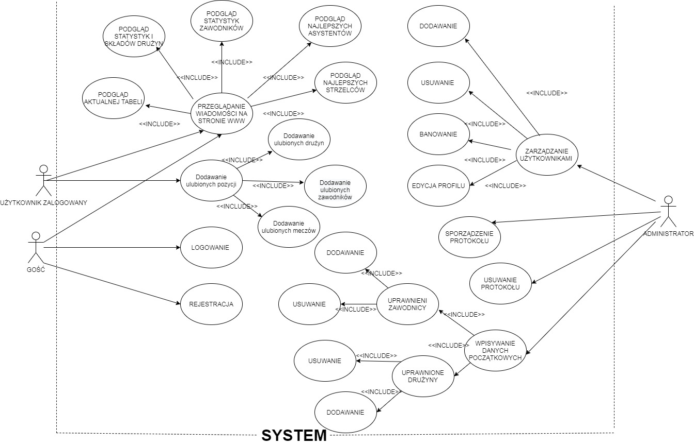

## Features

Main Page: 

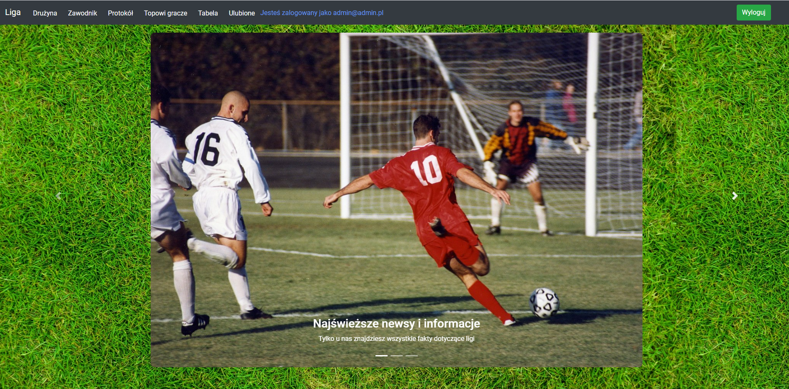

 Create an account

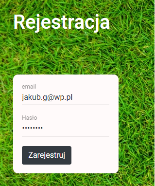

Sign in 

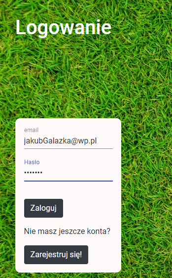

After loggin

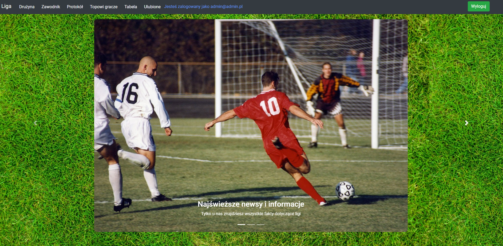

User management

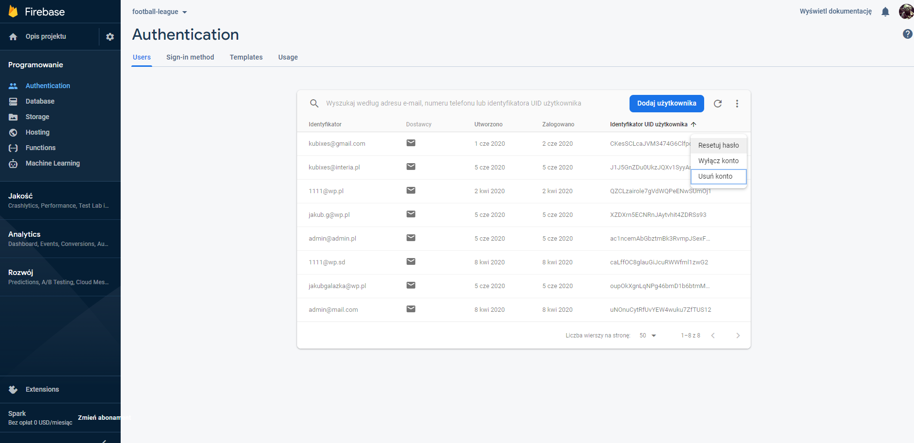

Delete player 

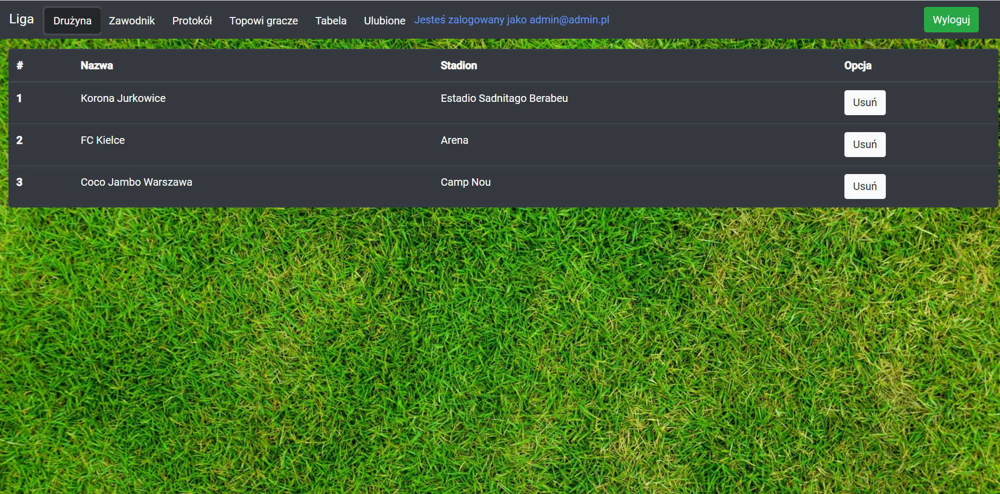

Favourite items

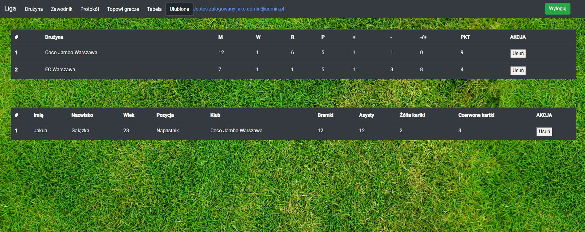

Add protocol

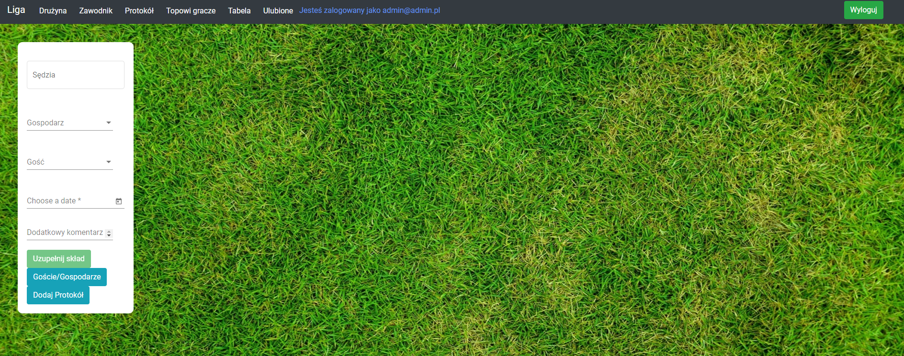

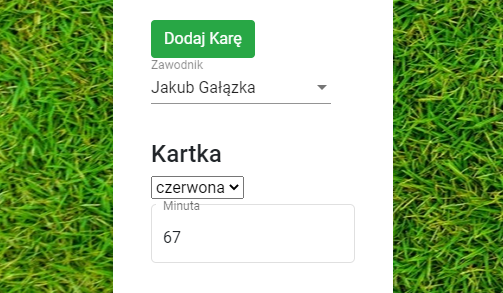

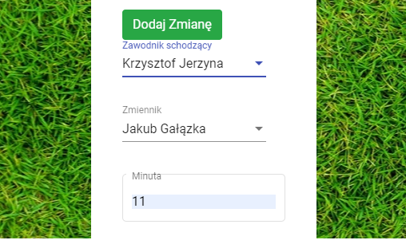

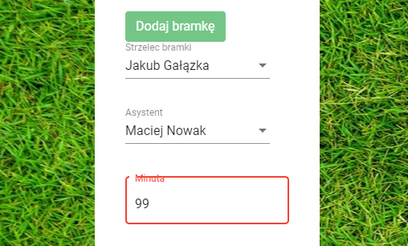

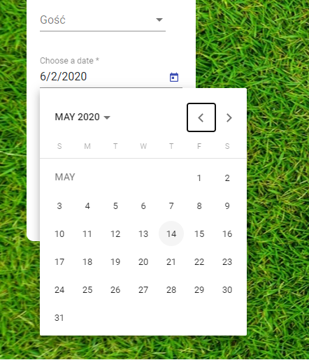

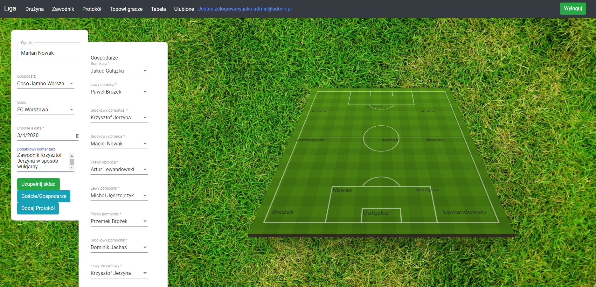

Sezon table 

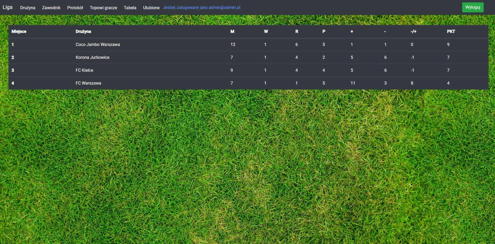
